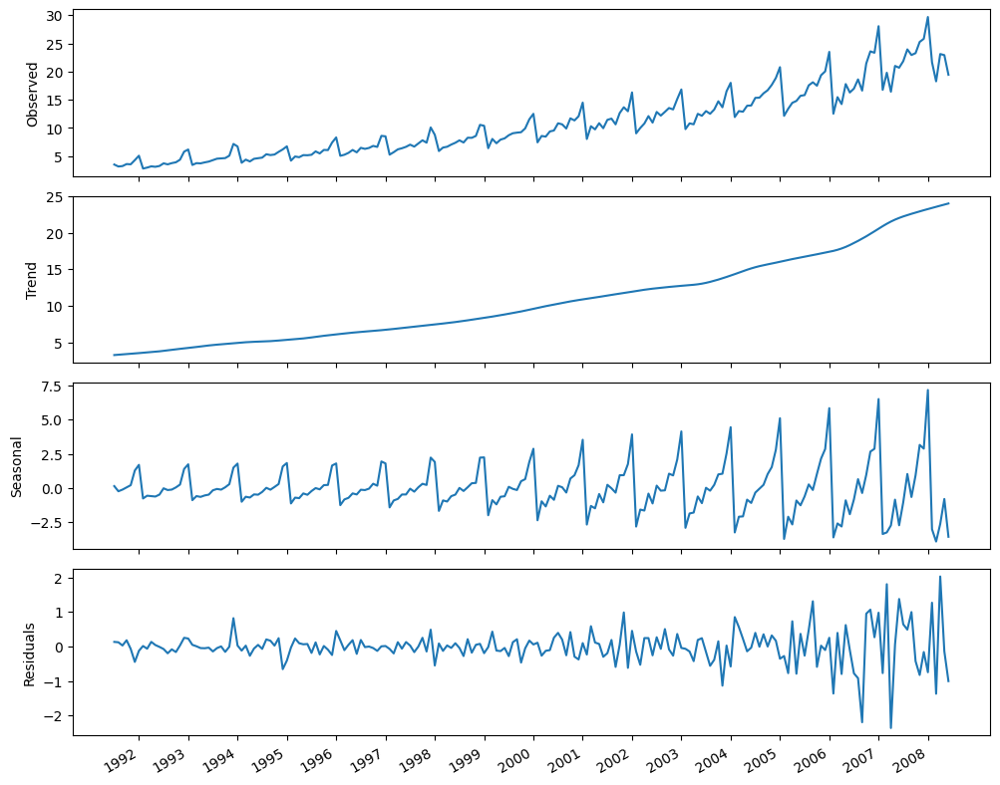
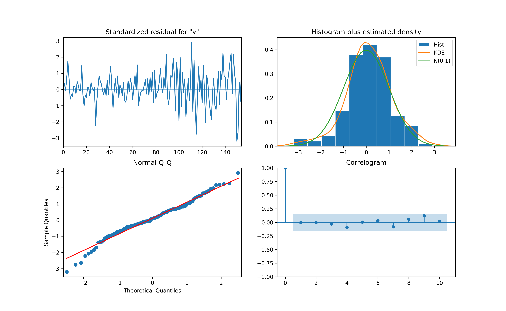

### Forecasting the number of antidiabetic drug prescriptions in Australia

- We will be using timeseries techniques to solve this project problem.

#### Objective:
- The objective of the project is forecasting the number of antidiabetic drug prescriptions in Australia, from 1991 to 2008.
- To solve the problem of overproduction of the antidiabetic drugs by predictioning how much is needed.

#### Steps
- a. Visualize the timeseries
- b. Use timeseries decomposition to extract trend,seasonality components and the residuals.
- c. Determine the most suitable model
- d. model the series with:
    - apply transformation to make it stationary
    - set the values of *d* and D. set the value of *m*
    - find the optimal (p,d,q)(P,D,Q)*m*
    - perform residual analysis to validate the model.
- e. Perform rolling forecast of 12 months on the test set.
- f. Visualize your forecasts.
- g. Compare the model's performance to a baseline 

### Results 
#### 1. plots
- After performing decomposition on the data we get the following components: Trend , seasonality and the residuals. Which help in determing which model to use:

- We observe the timeseries decomposition of the antidiabetics drug presecription dataset.
    - The first plot shows the observed data
    - The second plot shows the trend component; increasing demand for antidiabetic drugs over the years.
    - The third plot shows seasonality component; we see repetiting patterns over time.
    - Final plot shows the residuals; variations that are not accounted for by seasonality and trend components.

#### 2. Modelling
- The SARIMA() model is picked because there is seasonality; we dont pick the VAR because we are not dealing with multiple interrelated timeseries data.
- After checking for stationary from the data using `augmented Dickey-Fuller test` we get a `p-value `  of 1.0. Thus we fail to reject the null hypothesis and conclude that the data need to be transformed to make it stationary.
- We perform first order differencing to the data and test for stationarity (ADF test) geting a p-value of 0.116. Which is greater than 0.05.Once again we fail to reject the null hypothesis; Hence we move to second order differencing.
- We then perform a seasonal difference; this returns a p-value < 0.05 after testing for stationarity. Hence we reject the null hypothesis , since our data is now stationary.
- From the above we differenced the series once hence d=1 and performed one seasonal differencing hence D = 1, and since the data is in months m=12.==>SARIMA(p,1,q)(P,1,Q)*12*

#### 3. Finding optimal degrees of seasonality and non-seasonality 
- We have a function `optimize_SARIMAX` that gives optimal parameters that minimize the Akaike information criterion(AIC). These are SARIMA(3,1,1)(1,1,3)*12*. ie the minimum the akaike information criterion the better.

#### 4. Residual analysis
- We need to check whether the residuals behave like white noise using `plot_diagnostics` to quantitatively analyse residuals.

    - From the topleft we can see that the residuals have no trend over time and variance seems constant.
    - On the topright ; the distribution follows a normal distribution whaich is further supported by the QQ plot.
    - Finally the correlogram at the bottom right shows no significant coeffients after lag 0.
    - All these are characteristcs of white noise , hence the model can be used further for prediction.

